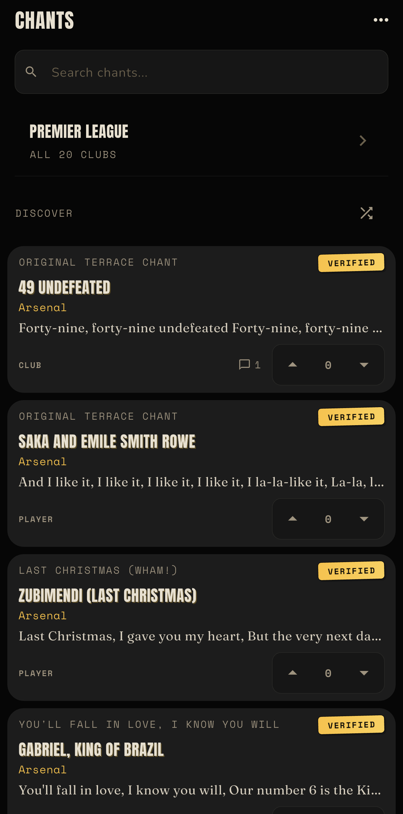
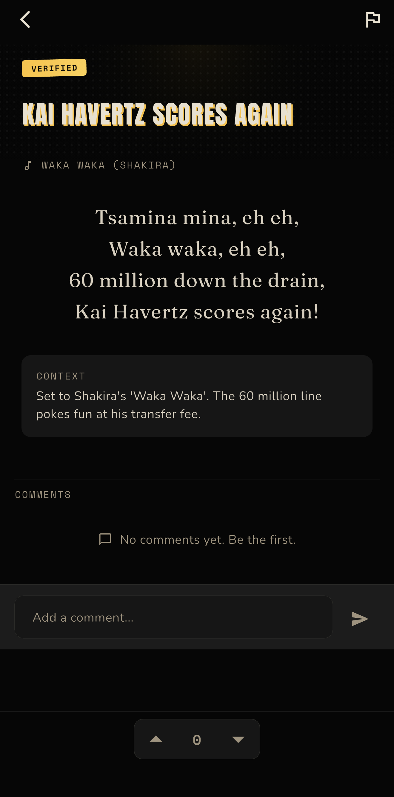
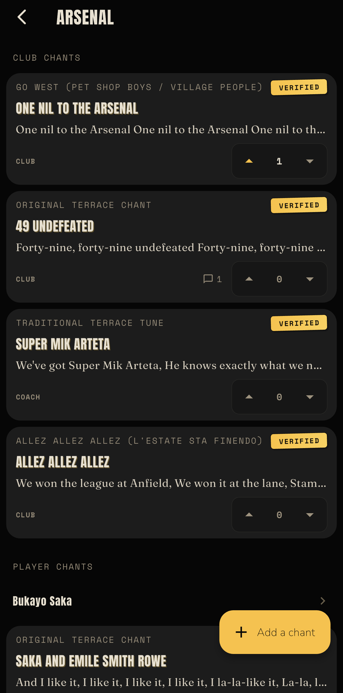
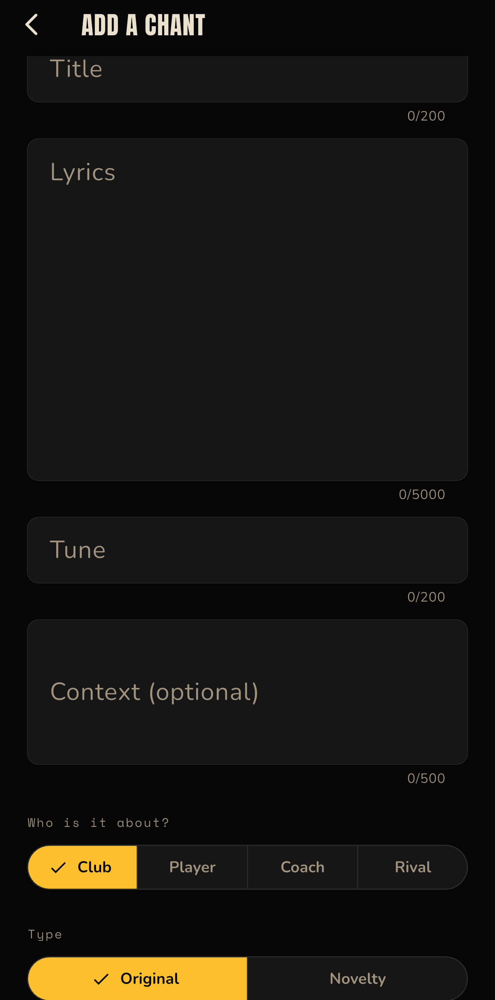

# Chants

**The songbook of the terraces.**

Chants is a mobile app where football fans find, learn, and contribute the chants sung on the terraces. Every chant has its lyrics, the tune it is sung to, and the story behind it. Fans vote the good ones up, comment on them, and submit the ones that are missing.

> **Status:** In active development. App Store submission is in progress; not yet live on the stores. Arsenal is fully seeded; the remaining Premier League clubs are being added.

---

## Screenshots and Demo

| Home and Discover | Chant detail: lyrics, tune, and context | Club screen: chants ranked by score | Submit a chant |
|:-:|:-:|:-:|:-:|
|  |  |  |  |

**Live demo:** [Landing page](TODO: url)

> TestFlight / Google Play testing link and a demo GIF will go here once the app is in review.

---

## Features

- **Browse by competition and club.** Drill down from the Premier League to a club, then to a player, then to a specific chant. Clubs show their chants ranked by score, with verified (canonical) content leading on ties.
- **Learn-focused chant detail.** Lyrics, tune name, context notes explaining the history, and an "Also sung as" section for alternate versions when they exist.
- **Community submission.** Any signed-in user can add a chant. Submissions enter as community content; operators can verify them.
- **Voting.** Upvote, downvote, or remove your vote. Score updates instantly (optimistic UI) and reconciles against the server.
- **Comments with likes.** Flat comment threads on every chant. One like per person per comment. Comments sort by most liked, then newest.
- **Reporting and moderation.** Flag a chant or comment. Auto-hide at a configurable report threshold. Operator tools for hide, remove, ban, and unban, with a full audit log. Rate limits for new and established accounts.
- **Discover.** A shuffled mix of chants across all clubs on the home screen, with live-updating scores.
- **Search.** Filter chants by title, lyrics, tune name, or club name with results updating as you type.
- **Account management.** Email/password auth, password reset, and full in-app account deletion (anonymizes contributions, removes personal data, reconciles counters).

---

## Tech Stack

| Layer | Technology | Version / Detail |
|-------|-----------|-----------------|
| Mobile framework | Flutter (Dart) | SDK ^3.10.8 |
| State management | Riverpod | flutter_riverpod ^2.6.1, riverpod_annotation ^2.6.1 |
| Auth | Firebase Auth | ^6.5.1 |
| Database | Cloud Firestore | ^6.4.1 |
| Server logic | Cloud Functions (TypeScript, Node 20) | firebase-functions ^6.3.0, firebase-admin ^13.0.0 |
| Integrity | Firebase App Check | ^0.4.4+1 (soft-enforce, DeviceCheck / Play Integrity) |
| Observability | Firebase Crashlytics | ^5.2.2 |
| Testing | flutter_test, Mockito, Mocha | Widget, model, security-rules, and Cloud Functions tests |

---

## Architecture

### Project layout

```
lib/
  app/            # Theme, colors, spacing tokens, router, Riverpod providers
  data/
    models/       # Dart data classes (Chant, Comment, Vote, UserProfile, etc.)
    repositories/ # Firestore read/write layer (one per collection)
    services/     # Pure logic (chant matching, ranking)
  presentation/   # Screens and widgets, grouped by feature
    auth/         # Sign in, sign up, password reset
    browse/       # Home, competition, club, player, chant detail
    comments/     # Comment section and card
    moderation/   # Operator moderation screen
    report/       # Report bottom sheet (shared by chants and comments)
    shared/       # Reusable widgets (vote controls, chant card, empty/error states)
    submit/       # Chant submission screen
    feedback/     # Suggestion box

functions/src/    # Cloud Functions (TypeScript)
seed/             # Admin SDK seed script and validation
test/             # Flutter tests (models, widgets, services)
test_rules/       # Firestore security-rules tests
```

### Data model

```
Sport
  └── Competition (e.g. Premier League)
        └── Team
              └── Chant (flat top-level collection, denormalized teamId/playerId)
                    ├── Vote      (one per user per chant)
                    ├── Comment   (flat, no nesting)
                    │     └── CommentLike (one per user per comment)
                    └── Report / CommentReport
```

Chants are stored in a single flat Firestore collection with denormalized IDs. This gives cheap drill-down queries (all chants for a team) and cheap cross-club queries (the discover shuffle) without joins or collectionGroup queries.

### Cloud Functions

Nine deployed functions (all `europe-west2`):

| Function | Trigger | Purpose |
|----------|---------|---------|
| `onVoteWritten` | Vote doc write | Recompute chant score, upvotes, downvotes from all vote docs |
| `onChantCreated` | Chant doc create | Rate-limit enforcement (auto-hide excess) |
| `onCommentWritten` | Comment doc write | Recompute commentCount on the parent chant; rate-limit on create |
| `onCommentLikeWritten` | CommentLike doc write | Recompute likeCount on the comment |
| `onReportCreated` | Report doc create | Increment flagCount, auto-hide at threshold |
| `onCommentReportCreated` | CommentReport doc create | Increment flagCount on comment, auto-hide at threshold |
| `onModerationAction` | HTTPS callable | Operator hide/unhide/remove/ban/unban with audit log |
| `deleteAccount` | HTTPS callable | Full account deletion with data cleanup and counter reconciliation |
| `mergeChants` | HTTPS callable | Operator duplicate merge with source-payload snapshot for undo |

---

## Engineering Highlights

**Counters recomputed from ground truth.** Vote tallies, comment counts, and comment like counts are never blindly incremented. Each Cloud Function queries the actual stored documents and sets an absolute value. This makes every counter function idempotent under at-least-once delivery, duplicate triggers, and out-of-order events. If a counter ever drifts, the next write self-corrects it.

**Optimistic UI with server reconciliation.** Votes and comment likes update the display instantly, then reconcile when the server stream delivers the Cloud Function's recomputed value. A busy guard drops taps while a write is in flight, and a pending-intent latch collapses rapid taps into at most two writes, preventing the score drift that would otherwise occur from concurrent writes to the same document.

**Security-first Firestore rules.** Rules start locked (deny by default). Every privileged field (role, banned, counters, flags, hidden, removed) is pinned on create and blocked from self-update. This prevents a user from self-promoting to operator via a crafted SDK write, a class of privilege-escalation bug that was caught and fixed during review. Queries must include visibility filters or Firestore rejects them entirely. Field-length limits are enforced server-side, not just in the client.

**Content integrity.** All seed content (lyrics, squads, cultural context) is externally sourced and verified by hand. The build process can only transform supplied data in place; it never generates or rewrites content. This is a standing rule with the highest priority in the project.

**Test coverage across layers.** 141 Flutter tests (models, services, widgets, and screen-level tests including controllable-async rapid-tap scenarios), Firestore security-rules tests, and Cloud Functions unit tests. Regression guards for timing-sensitive UI (vote reconciliation, comment like crashes) are widget-level tests against the real widget, verified by reintroducing the bug and confirming the test fails.

---

## Getting Started

### Prerequisites

- Flutter SDK (^3.10.8)
- A Firebase project with Auth, Firestore, and Cloud Functions enabled
- Node 20 (for Cloud Functions)

### Setup

1. Clone the repo.
2. Create your own Firebase project and add your config files. `firebase_options.dart` and the platform-specific Google services files (`GoogleService-Info.plist`, `google-services.json`) are gitignored, so you need your own.
3. Deploy Firestore rules and indexes:
   ```
   firebase deploy --only firestore
   ```
4. Deploy Cloud Functions:
   ```
   cd functions && npm install && npm run build && firebase deploy --only functions
   ```
5. Install Flutter dependencies and run:
   ```
   flutter pub get
   flutter run
   ```

### Running tests

```bash
# Flutter tests (models, widgets, services)
flutter test

# Cloud Functions tests
cd functions && npm test

# Firestore security-rules tests (requires the Firebase emulator)
cd test_rules && npm install && npm test

# Seed validation tests
cd seed && npm install && npm test
```

---

## Documentation

This project is planned and documented in detail:

- **[ROADMAP.md](docs/ROADMAP.md)** — launch phases, current status, and gated triggers for each phase.
- **[DECISIONS.md](docs/DECISIONS.md)** — every architectural decision with its date, reasoning, and trigger to revisit.
- **[HANDBOOK.md](docs/HANDBOOK.md)** — plain-language manual for every shipped feature, written at a 9th-grade reading level.
- **[CHANTS_SPEC.md](docs/CHANTS_SPEC.md)** — the full product specification.

---

Copyright (c) 2026 Andrew Bolaji. All rights reserved.
