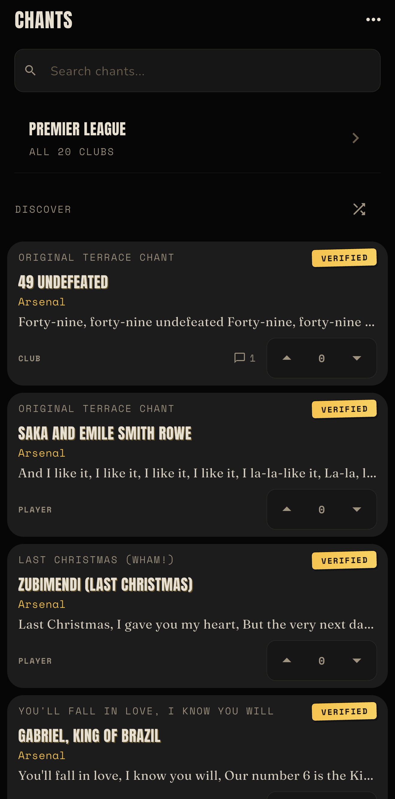
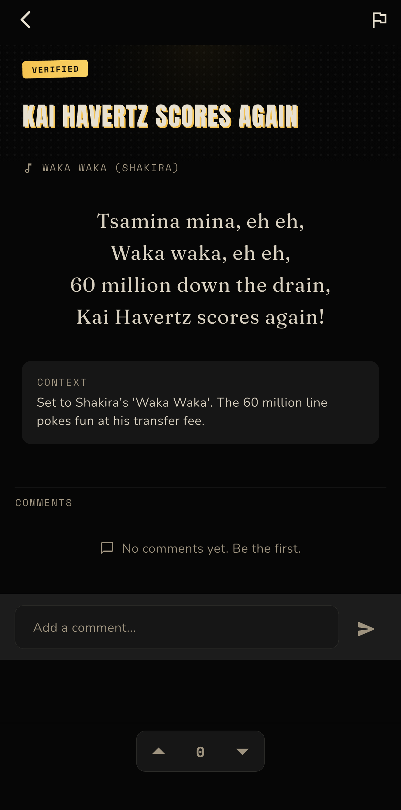
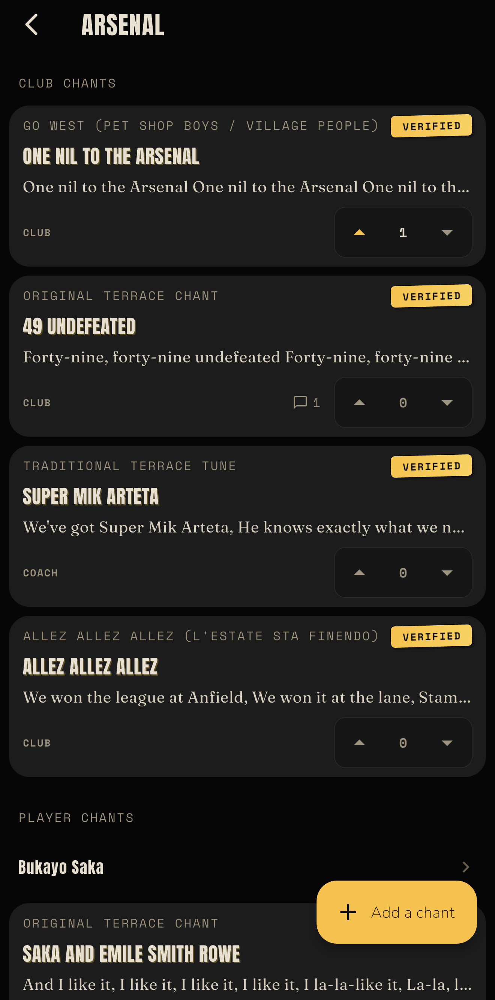

# Chants

[](https://github.com/andrewbolaji/Chants/actions/workflows/ci.yml)

**The songbook of the terraces and the workshop for what gets sung next.**

Chants is a mobile app where football fans find and learn terrace songs, contribute the ones that are missing, and back new ideas that deserve to be sung next. Every chant has its lyrics, the tune it is sung to, and the story behind it. Fans can already vote, comment, and create; the remaining v1 work makes the trusted Songbook and community Chant Lab distinction explicit.

> **Status:** In active development. App Store submission is in progress; not yet live on the stores. Arsenal is fully seeded; the remaining Premier League clubs are being added.

---

## Screenshots and Demo

| Home and Discover | Chant detail: lyrics, tune, and context | Club screen: chants ranked by score |
|:-:|:-:|:-:|
|  |  |  |

**Live demo:** [chantsfc.com](https://chantsfc.com) (coming soon)

> TestFlight / Google Play testing link and a demo GIF will go here once the app is in review.

---

## Features

- **Browse by competition and club.** Drill down from the Premier League to a club, then to a player, then to a specific chant. Clubs show their chants ranked by score, with verified (canonical) content leading on ties.
- **Learn-focused chant detail.** Lyrics, tune name, context notes explaining the history, and an "Also sung as" section for alternate versions when they exist.
- **Community submission.** Any signed-in user can add a chant. Submissions enter as community content; operators can verify them.
- **Voting.** Upvote, downvote, or remove your vote. Score updates instantly (optimistic UI) and reconciles against the server.
- **Comments with likes and direct replies.** Top-level comments sort by most liked, then newest; one chronological reply level sits below each parent. Users can block another account and manage their block list.
- **Reporting and moderation.** Flag a chant or comment. Auto-hide at a configurable report threshold. Operator tools for hide, unhide, remove, and ban, with an audit log. Rate limits for new and established accounts.
- **Discover.** A shuffled mix of chants across all clubs on the home screen, with live-updating scores.
- **Search.** Filter chants by title, lyrics, tune name, or club name with results updating as you type.
- **Account management.** Email/password auth, password reset, and in-app account deletion with contribution anonymization and counter reconciliation. Remaining lifecycle gaps are tracked in the engineering review documents.

---

## Tech Stack

| Layer | Technology | Version / Detail |
|-------|-----------|-----------------|
| Mobile framework | Flutter (Dart) | SDK ^3.10.8 |
| State management | Riverpod | flutter_riverpod ^2.6.1, riverpod_annotation ^2.6.1 |
| Auth | Firebase Auth | ^6.5.1 |
| Database | Cloud Firestore | ^6.4.1 |
| Server logic | Cloud Functions (TypeScript, Node 20) | firebase-functions ^6.3.0, firebase-admin ^13.0.0 |
| Integrity | Firebase App Check | ^0.4.4+1 (soft-enforce, DeviceCheck / Play Integrity) |
| Observability | Firebase Crashlytics | ^5.2.2 |
| Testing | flutter_test, Mockito, Mocha | Widget, model, security-rules, and Cloud Functions tests |

---

## Architecture

### Project layout

```
lib/
  app/            # Theme, colors, spacing tokens, router, Riverpod providers
  data/
    models/       # Dart data classes (Chant, Comment, Vote, UserProfile, etc.)
    repositories/ # Firestore read/write layer (one per collection)
    services/     # Pure logic (chant matching, ranking)
  presentation/   # Screens and widgets, grouped by feature
    auth/         # Sign in, sign up, password reset
    browse/       # Home, competition, club, player, chant detail
    comments/     # Comment section and card
    settings/     # Blocked-user management
    moderation/   # Operator moderation screen
    report/       # Report bottom sheet (shared by chants and comments)
    shared/       # Reusable widgets (vote controls, chant card, empty/error states)
    submit/       # Chant submission screen
    feedback/     # Suggestion box

functions/src/    # Cloud Functions (TypeScript)
seed/             # Admin SDK seed script and validation
test/             # Flutter tests (models, widgets, services)
test_rules/       # Firestore security-rules tests
```

### Data model

```
Sport
  └── Competition (e.g. Premier League)
        └── Team
              └── Chant (flat top-level collection, denormalized teamId/playerId)
                    ├── Vote      (one per user per chant)
                    ├── Comment   (top-level or one direct reply)
                    │     ├── CommentLike (one per user per comment)
                    │     └── parentCommentId (null/missing for top-level)
                    └── Report / CommentReport

Block (directional, one per blocker/blocked-user pair)
```

Chants are stored in a single flat Firestore collection with denormalized IDs. This gives cheap drill-down queries (all chants for a team) and cheap cross-club queries (the discover shuffle) without joins or collectionGroup queries.

### Cloud Functions

Eleven Functions exports in source (all configured for `europe-west2`; live deployment state is verified separately):

| Function | Trigger | Purpose |
|----------|---------|---------|
| `onVoteWritten` | Vote doc write | Recompute chant score, upvotes, downvotes from all vote docs |
| `onChantCreated` | Chant doc create | Rate-limit enforcement (auto-hide excess) |
| `onCommentWritten` | Comment doc write | Recompute commentCount on the parent chant; rate-limit on create |
| `onCommentLikeWritten` | CommentLike doc write | Recompute likeCount on the comment |
| `onReportCreated` | Report doc write | Recompute pending-report flagCount, auto-hide at threshold |
| `onCommentReportCreated` | CommentReport doc write | Recompute pending-report flagCount on comment, auto-hide at threshold |
| `onModerationAction` | HTTPS callable | Operator hide/unhide/remove/ban and promote/demote actions with audit log |
| `deleteAccount` | HTTPS callable | Account deletion, data cleanup, anonymization, and counter reconciliation |
| `mergeChants` | HTTPS callable | Operator duplicate merge that moves votes, reports, comments, and replies |
| `acceptPolicy` | HTTPS callable | Validate and record acceptance of the current content policy |
| `onUserReportCreated` | UserReport doc create | Recompute the reported user's distinct-report count |

---

## Engineering Highlights

**Core interaction counters recomputed from ground truth.** Vote tallies, comment counts, comment like counts, user-report counts, and chant/comment flag counts are recomputed from stored documents. The report counters use transactions around their ground-truth query and target write, so duplicate and racing trigger deliveries converge without blind increments.

**Optimistic UI with server reconciliation.** Votes and comment likes update the display instantly, then reconcile when the server stream delivers the Cloud Function's recomputed value. A busy guard drops taps while a write is in flight, and a pending-intent latch collapses rapid taps into at most two writes, preventing the score drift that would otherwise occur from concurrent writes to the same document.

**Security-first Firestore rules.** Rules start locked (deny by default). Privileged profile and counter fields are constrained against client writes, interaction targets must exist and be visible, reply depth and relationships are enforced server-side, and vote/like/profile reads are limited to their owner or an operator.

**Content integrity.** All seed content (lyrics, squads, cultural context) is externally sourced and verified by hand. The build process can only transform supplied data in place; it never generates or rewrites content. This is a standing rule with the highest priority in the project.

**Test coverage across layers.** 182 Flutter tests (including phone-sized reply-thread and operator-access goldens), 106 Firestore security-rules assertions, 26 Cloud Functions tests, and 23 seed-pipeline tests. Regression guards for timing-sensitive UI and reply grouping run against the real widgets; reply ordering was also proven red against a deliberate production mutation and green after restoration.

---

## Getting Started

### Prerequisites

- Flutter SDK (^3.10.8)
- A Firebase project with Auth, Firestore, and Cloud Functions enabled
- Node 20 (for Cloud Functions)

### Setup

1. Clone the repo.
2. Create your own Firebase project and add your config files. `firebase_options.dart` and the platform-specific Google services files (`GoogleService-Info.plist`, `google-services.json`) are gitignored, so you need your own.
3. Deploy Firestore rules and indexes:
   ```
   firebase deploy --only firestore
   ```
4. Deploy Cloud Functions:
   ```
   cd functions && npm install && npm run build && firebase deploy --only functions
   ```
5. Install Flutter dependencies and run:
   ```
   flutter pub get
   flutter run
   ```

### Running tests

```bash
# Flutter tests (models, widgets, services)
flutter test

# Cloud Functions tests
cd functions && npm test

# Firestore security-rules tests (requires the Firebase emulator)
cd test_rules && npm install && npm test

# Seed validation tests
cd seed && npm install && npm test
```

---

## Documentation

This project uses one documentation lifecycle:

- **[CHANGE_SPEC.md](docs/CHANGE_SPEC.md)** - the one active proposed or approved implementation block.
- **[EXECUTION.md](docs/EXECUTION.md)** - timestamped evidence and state transitions for substantial current work.
- **[LEARNINGS.md](docs/LEARNINGS.md)** - reusable lessons backed by reproduced or verified evidence.
- **[INTERFACE.md](docs/INTERFACE.md)** - the current UI contract and durable interaction decisions.
- **[Completed changes](docs/changes/README.md)** - what changed, why, and how it was verified.
- **[Durable decisions](docs/decisions/README.md)** - accepted decisions, reasons, consequences, and revisit triggers.
- **[ROADMAP.md](docs/ROADMAP.md)** - product sequencing and release gates.
- **[ENGINEERING_OVERVIEW.md](ENGINEERING_OVERVIEW.md)** and **[IMPLEMENTATION_RATIONALE.md](docs/IMPLEMENTATION_RATIONALE.md)** - milestone review snapshots.
- **[HANDBOOK.md](docs/HANDBOOK.md)** - plain-language manual for shipped features.
- **[CHANTS_SPEC.md](docs/CHANTS_SPEC.md)** - the product specification.

`docs/DECISIONS.md` and `docs/BLOCK_RECAPS.md` remain as historical archives for work completed before the current framework.

---

Copyright (c) 2026 Andrew Bolaji. All rights reserved.
