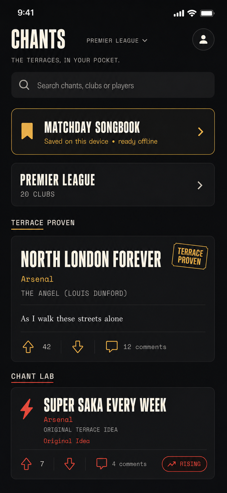
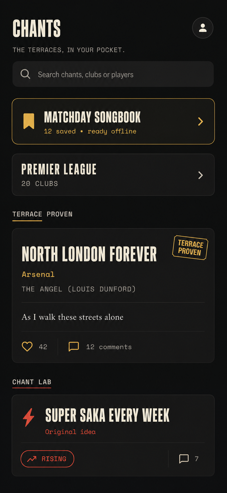
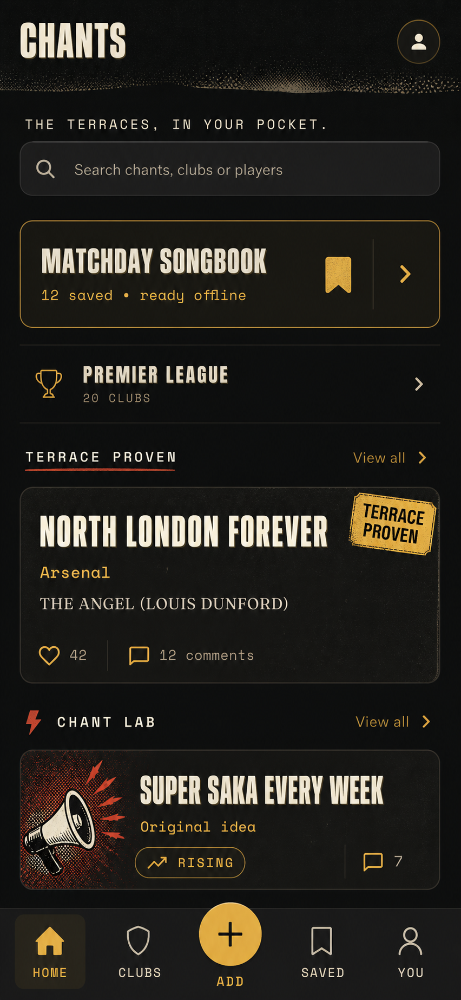

# Interface concepts

These are exploratory product-design artifacts, not the current interface contract. A concept changes runtime only after an approved specification, implementation evidence, and an explicit interface decision.

## Home redesign concept V3, final potential pass



- **Created:** 2026-08-26
- **Status:** Final visual reference for the approved bounded Home hierarchy refresh
- **Purpose:** Test the implemented Chants direction against the polished information architecture and scannable action alignment of a modern native ranking app without copying its food identity, light palette, ranking claims, photo dependence, or bottom navigation.
- **Decision:** Retain Chants V2 as the product structure. Borrow V3's consistent card boundaries, internal dividers, tighter grouping, and reserved action alignment. Do not add the concept's decorative league chevron, rank treatments, new navigation, or any unsupported state.
- **Generated asset:** `docs/mockups/chants-home-redesign-concept-v3.png`, SHA-256 `20de523851a04fd6b5105f56069b92203a13303e6157f5b58d6b72090991fe5f`

### Generation method

Built-in image editing used the selected V2 Chants concept as the brand and content authority and Andrew's Vouch screenshot only as an information-architecture and native-app polish reference.

### Final prompt

```text
Create one final high-fidelity iPhone portrait UI mockup for the Chants football supporter app Home screen. Reference image 1 is the current approved Chants direction and must remain the brand/content authority. Reference image 2 is Vouch, a food ranking app; borrow only its polished native-app information architecture, disciplined spacing, confident top bar, clear grouping, scannable content density, and reserved action alignment. Do not copy its light palette, restaurant imagery, logo, labels, rankings, or food-app identity.

The result must feel unmistakably like modern English football terrace culture: warm near-black background, cream typography, restrained terrace gold for trusted content, and one muted coral-red accent for community creativity. Keep it refined, current, practical, and fun, with the clarity of a real shipping mobile app. Avoid grunge overload, fake distressed textures, graffiti, neon, glassmorphism, gradients, photos, stadium imagery, club crests, and decorative noise. Use subtle separators and restrained outlined surfaces. Preserve the existing app's condensed football-poster display voice for CHANTS and chant titles, a highly legible rounded UI sans for controls/support text, and monospace only for short labels/metadata.

Use this exact truthful product structure and copy:
- top app bar: CHANTS at left, a small understated PREMIER LEAGUE context label or control in the middle only if it is clearly not pretending multiple leagues exist, circular profile icon at right
- a quiet secondary line: THE TERRACES, IN YOUR POCKET.
- rounded search field: Search chants, clubs or players
- compact prominent Matchday Songbook utility with bookmark icon and exact support copy Saved on this device • ready offline; do not invent a saved count
- one clear Premier League browse entry with 20 clubs
- Terrace Proven section for one trusted chant, using exact example NORTH LONDON FOREVER, Arsenal, THE ANGEL (LOUIS DUNFORD), a one-line lyric preview, Terrace Proven badge, score 42 and 12 comments
- Chant Lab section for one community idea, using exact example SUPER SAKA EVERY WEEK, Arsenal, ORIGINAL TERRACE IDEA, Original Idea, Rising, score 7 and 4 comments

Improve on reference 1 using the modern app discipline from reference 2: tighter vertical rhythm, clearer grouping, more deliberate alignment of score/comments/action zones, a slightly more compact featured trusted card and a clean compact community row or card, polished dividers, and a top area that reads like a native app rather than a poster. Keep both Terrace Proven and Chant Lab visible in the meaningful scroll. Do not add bottom navigation, View all, Add, rank numbers, Top 5/Top 10 tabs, daily-update claims, like-heart replacement, photos, or any destination the current app does not have. Voting remains up arrow, score, down arrow. Make every label clean and correctly spelled. This is a final design-potential pass, not a simplification exercise and not a Vouch clone.
```

## Home redesign concept V2, selected direction



- **Created:** 2026-08-26
- **Status:** Selected product structure; visually refined by the V3 comparison above
- **Purpose:** Refine V1 into a calmer, simpler, realistically shippable Home that keeps the app fun without turning every surface into decoration.
- **Decision:** Adopt the clearer Home hierarchy, quieter tagline, stronger Matchday Songbook utility, and separate Terrace Proven and Chant Lab previews. Preserve existing push navigation. Do not add persistent bottom navigation, fake View all actions, new data queries, or global route architecture.
- **Generated asset:** `docs/mockups/chants-home-redesign-concept-v2.png`, SHA-256 `feaf53c62a61177524f18e498bf5f734bec55388337859faa8083cba8438cdf6`

### Generation method

Built-in image editing used the tracked V1 concept as the edit target. The pass reduced ornament, regularized typography, removed unsupported navigation, and aligned the design with current Flutter routes and tokens.

### Final prompt

```text
Use case: ui-mockup
Asset type: final high-fidelity mobile Home screen direction for the Chants Flutter app
Input image: Image 1 is the edit target and earlier redesign concept. Preserve its Chants identity, palette, content hierarchy, and overall portrait proportions, but refine it into a calmer, more basic and realistically shippable V1 screen.
Primary request: Make one disciplined final design pass that balances fun terrace-fanzine personality with simple product usability. The result should feel distinctive but not busy, premium but not precious, and easy to scan at a crowded football ground.
Typography and sizing: use a condensed cream display face only for the app name and chant titles; use a clean highly legible sans-serif for descriptions and search; use a restrained monospaced face only for short labels and metadata. Establish a consistent scale resembling: app title 32-36px, chant titles 21-24px, utility title 20-22px, section labels 12-14px, body/search 15-16px, metadata 11-13px. Avoid excessive letter spacing and avoid using display type for ordinary club rows.
Composition changes:
1. Keep compact exact title "CHANTS" and a simple circular account/menu control.
2. Keep exact line "THE TERRACES, IN YOUR POCKET." but make it a quiet secondary line, not a large banner.
3. Keep a compact rounded search field with exact placeholder "Search chants, clubs or players".
4. Keep "MATCHDAY SONGBOOK" as the most prominent utility, exact support "12 saved • ready offline", one bookmark icon, and a chevron. Reduce its height and ornament slightly.
5. Keep a simple "PREMIER LEAGUE" row with exact support "20 CLUBS" and chevron. Use a restrained icon or no icon.
6. Keep distinct "TERRACE PROVEN" and "CHANT LAB" sections, but remove both "View all" actions because no such route exists.
7. Terrace Proven card exact text: "NORTH LONDON FOREVER", "Arsenal", "THE ANGEL (LOUIS DUNFORD)", "42", "12 comments", and one compact "TERRACE PROVEN" badge. Include one calm single-line lyrics preview: "As I walk these streets alone" in a readable serif or clean body face.
8. Chant Lab card exact text: "SUPER SAKA EVERY WEEK", "Original idea", "RISING", "7". Use a small red lightning or megaphone accent, not a large illustration.
9. Remove the entire persistent bottom navigation and centered plus button. This pass must work with the app's existing push-navigation architecture.
10. End naturally after the Chant Lab preview with normal scroll continuation; no footer navigation.
Visual direction: warm black background, charcoal cards, cream type, terrace gold, one restrained burnt-red Chant Lab accent. Reduce grain, halftone, sticker roughness, glow, and decorative borders by about half. Use mostly flat surfaces, consistent 16-20px side padding, 12-16px vertical spacing, aligned card edges, comfortable 44px tap targets, and generous but not wasteful whitespace.
Constraints: realistic production UI, no device frame, no team crest, no player photo, no ads, no social-media chrome, no extra slogans, no gradient that harms contrast, no watermark, no illegible microtext, no bottom navigation, no View all labels. Render all specified text exactly once and preserve high contrast.
```

## Home redesign concept V1



- **Created:** 2026-08-26
- **Status:** Exploratory, not approved for implementation
- **Purpose:** Test whether stronger matchday utility, clearer Songbook and Chant Lab separation, richer fanzine texture, and persistent primary navigation would improve the Home screen.
- **Current decision:** None. The approved V1 interface-readiness block continues to preserve the existing navigation and visual contract while it establishes evidence and corrects verified defects.
- **Revisit when:** Andrew compares this direction with the current Home baseline and chooses whether persistent navigation and a broader redesign deserve a separate product change.
- **Generated asset:** `docs/mockups/chants-home-redesign-concept-v1.png`, SHA-256 `b121f60b6167f809e4a110dcb0bfae406b20526560cb459cd52f74e34b86e864`

### Generation method

Built-in image generation used the tracked July Home screenshot as a brand and style reference. No application code or source image was edited.

### Final prompt

```text
Use case: ui-mockup
Asset type: high-fidelity mobile app Home screen redesign concept for Chants
Input images: Image 1 is the current Chants Home screen and is a brand/style reference. Preserve its dark terrace-night palette, warm cream text, gold accent, condensed display typography, monospace fanzine labels, and calm serif reading text. Redesign the layout rather than copying it.
Primary request: Show how a more polished, distinctive, retention-focused Chants Home screen could land while remaining practical and shippable.
Style/medium: realistic premium mobile product UI, not concept art, no phone hardware frame, portrait 390 by 844 proportions, crisp and production-ready.
Composition/framing:
1. Compact top header with exact word "CHANTS" and a small circular profile/menu control.
2. One short fan-voiced line: "THE TERRACES, IN YOUR POCKET."
3. Compact rounded search field with exact placeholder "Search chants, clubs or players".
4. A prominent tactile matchday utility card titled "MATCHDAY SONGBOOK", with exact supporting text "12 saved • ready offline", bookmark icon, gold accent, and clear chevron.
5. A clean competition row labeled "PREMIER LEAGUE" with "20 CLUBS".
6. A section labeled "TERRACE PROVEN" with one featured trusted chant card. Exact text: "NORTH LONDON FOREVER", "Arsenal", "THE ANGEL (LOUIS DUNFORD)", "42", "12 comments". Include a small gold sticker reading "TERRACE PROVEN". Do not use a club crest.
7. A visually separate section labeled "CHANT LAB" with a compact rising community idea card. Exact text: "SUPER SAKA EVERY WEEK", "Original idea", "RISING", "7". Make it energetic but do not imply it is verified.
8. Persistent bottom navigation with five clear destinations: "HOME", "CLUBS", a centered gold plus button labeled "ADD", "SAVED", "YOU". Home is active.
Visual direction: evolved terrace fanzine, premium but fan-made. Warm black and charcoal surfaces, cream type, terrace gold, subtle ink grain and halftone only in header/chrome, slightly imperfect sticker edges, confident spacing, stronger scan hierarchy than the reference. The reading cards remain clean. Add one restrained burnt-red accent only if it improves hierarchy.
Accessibility: high contrast, 44px minimum touch targets, text labels as well as icons, no meaning by color alone, unclipped at the portrait viewport.
Constraints: practical mobile layout; all listed text rendered exactly once; no extra slogans; no gradients that reduce contrast; no team logos, player photos, ads, social media chrome, watermark, device frame, or illegible microtext.
```
